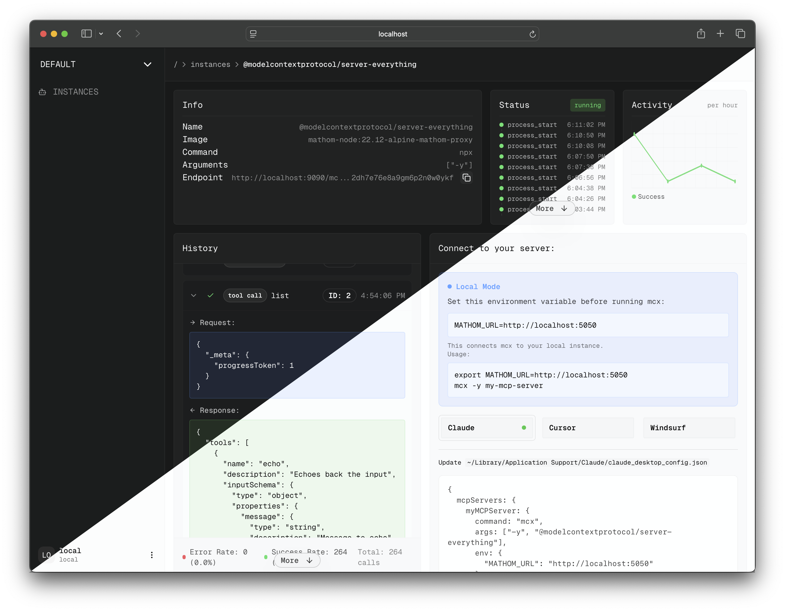

# mathom

<div align="center">
  
  
  
  <h3>Local-first MCP platform with OAuth2 for running and monitoring your servers</h3>
  
  <p>
    <a href="https://github.com/stephenlacy/mathom/blob/main/LICENSE">
      
    </a>
  </p>
</div>

I was tired of not having a way to run my MCP servers locally with auth in a way that I could deploy elsewhere.

- **Built-in OAuth2** - Works with MCP clients that support OAuth2
- **Monitoring** - Live logs, metrics, and status tracking
- **Dashboard** - Modern UI with dark/light themes
- **Quick Launch** - Just replace `npx` with `mcx`

## ⚡ Quick Start

Get up and running in less than 2 minutes:

```bash
# Install the CLI
npm install -g mcx

# Clone and start mathom
git clone https://github.com/stephenlacy/mathom.git
cd mathom
./quickstart.sh  # Builds and starts everything
```

Visit [http://localhost:5050](http://localhost:5050) and you're ready to go!

## Features

### Core Capabilities

<table>
<tr>
<td width="50%">

**Local-First Architecture**
- Run locally
- Your data and servers stay private
- (AWS/Cloud self-deployment coming soon...)

</td>
<td width="50%">

**Real-Time Monitoring**
- Live server logs
- Performance metrics
- Basic server debugging

</td>
</tr>
</table>

### UI

<div align="center">
  
  <p><i>Real-time monitoring dashboard with live metrics</i></p>
</div>

<div align="center">
  
  <p><i>light/dark theme support</i></p>
</div>

## Usage

### Launch your MCP Servers

```bash
# launch a server by name
mcx my-mcp-server

# launch from npm package
mcx @modelcontextprotocol/server-filesystem

# with custom arguments
mcx my-server -- --custom-arg value
```

### Claude/Cursor
- Claude: `~/Library/Application Support/Claude/claude_desktop_config.json`
- Cursor: `~/.cursor/mcp.json`

```json
{
  "mcpServers": {
    "myServer": {
      "command": "mcx",
      "args": ["my-mcp-server"],
      "env": {
        "MATHOM_URL": "http://localhost:5050"
      }
    }
  }
}
```

### Use with the Inspector

```bash
npx @modelcontextprotocol/inspector mcx @modelcontextprotocol/server-everything
```

## Documentation

### Installation

**Docker Installation** (Recommended)
```bash
docker compose up -d
```
Or use the [quickstart script](./quickstart.sh)

**Manual Installation**
- Docker
- Go
- Node.js
- PostgreSQL

### Configuration

**Environment Setup**
```bash
# .env file
BETTER_AUTH_URL=http://localhost:5050 # required
DATABASE_URL=postgresql://... # required
LOG_URL=http://... # required
NODE_DOCKER_IMAGE="you-custom-node-image" # optional
```

### Development

**Run locally:**
```bash
cd dashboard
pnpm install
pnpm dev

cd ../podrift
go run cmd/main.go
```

#### TODO:
- [x] local-first platform
- [x] OAuth2 auth
- [x] slick dashboard
- [x] run servers in docker
- [ ] team features

## License MIT
[License](./LICENSE)
